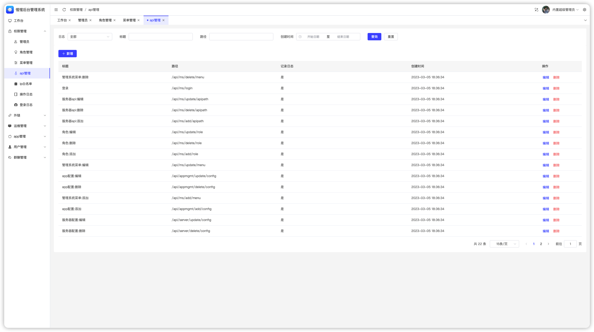

# xxim-mgmt-app

XXIM管理系统APP。web端

## 功能

- [x] 登录
- [x] 工作台
- [x] 权限管理：管理员管理、角色管理、菜单管理、API权限、操作日志、登录日志、IP白名单
- [x] 运维管理：服务配置、线路配置
- [x] APP管理：配置管理、版本管理、屏蔽词管理、VPN管理、公告管理、长连接管理、表情管理、外链管理
- [x] 用户管理：用户管理、默认会话管理、邀请码管理、IP黑名单、IP白名单、登录记录
- [x] 群聊管理：群聊管理

## 截图

- 登录

- 工作台

- 权限管理

- 管理员管理

- 角色管理

- 菜单管理

- API权限

- 操作日志

- 登录日志

- IP白名单

- 运维管理

- 服务配置

- 线路配置

- APP管理

- 配置管理

- 长连接管理

- 用户管理

- 用户管理

- 默认会话管理

- 群聊管理

- 群聊管理

